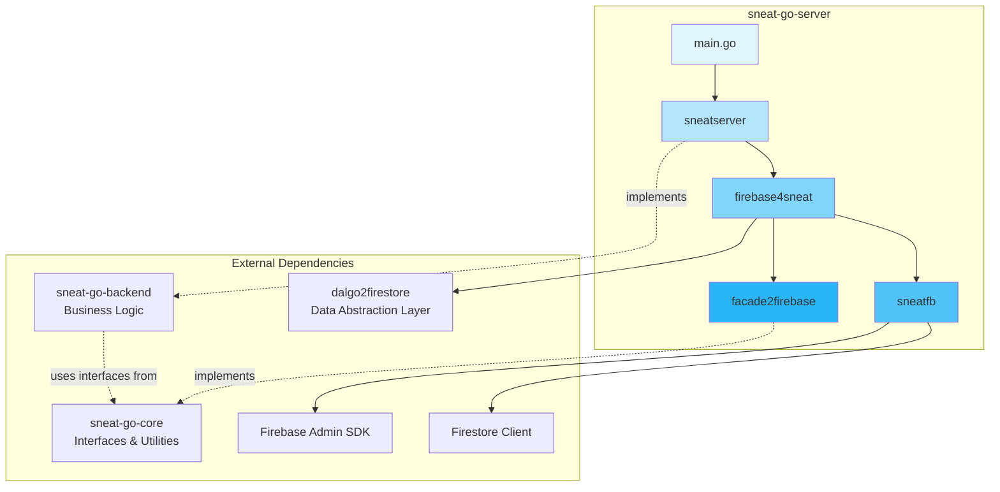
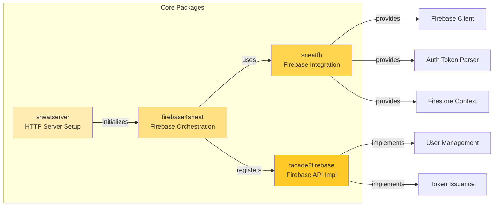
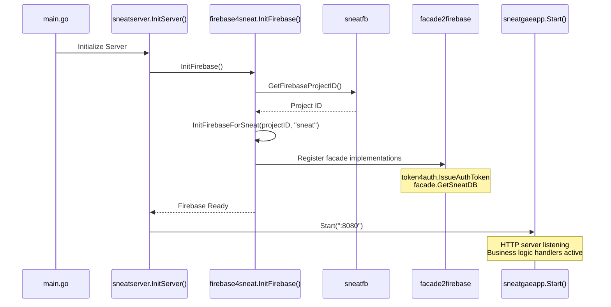
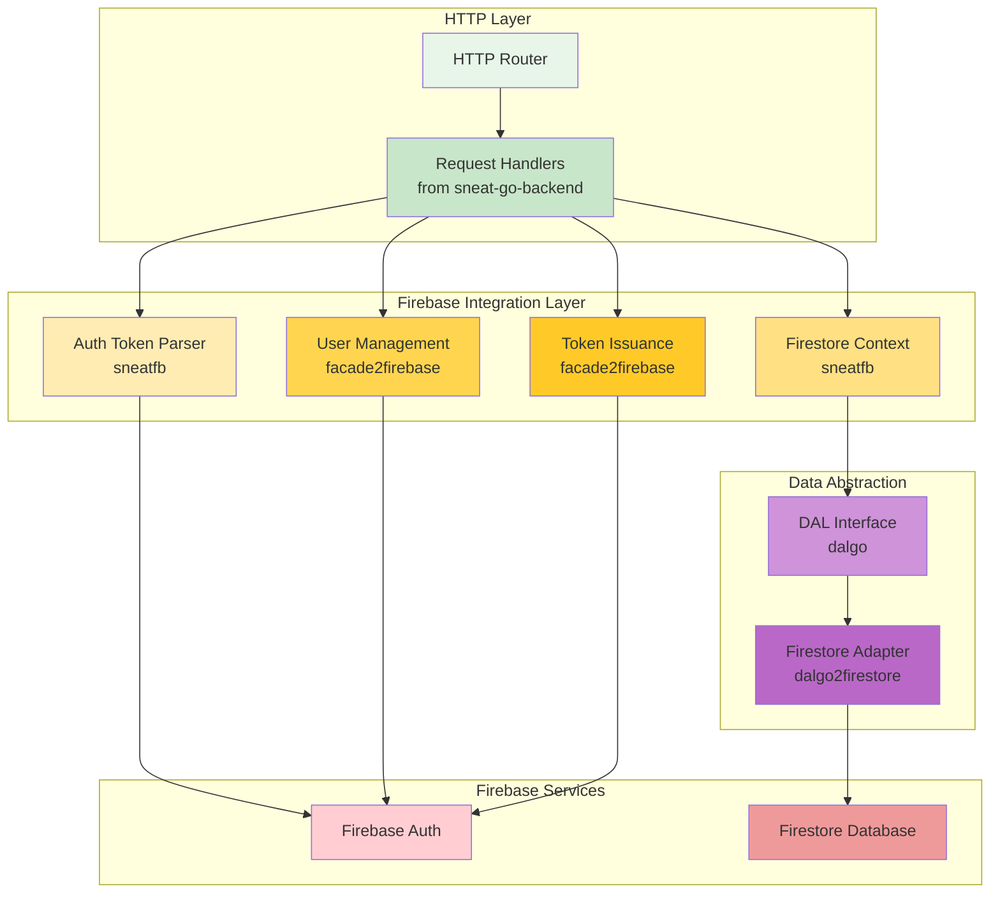
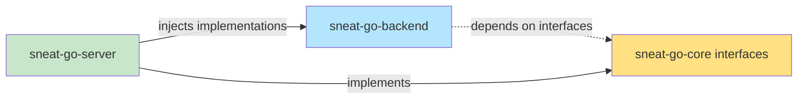
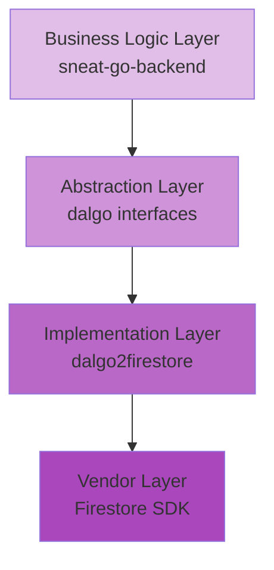
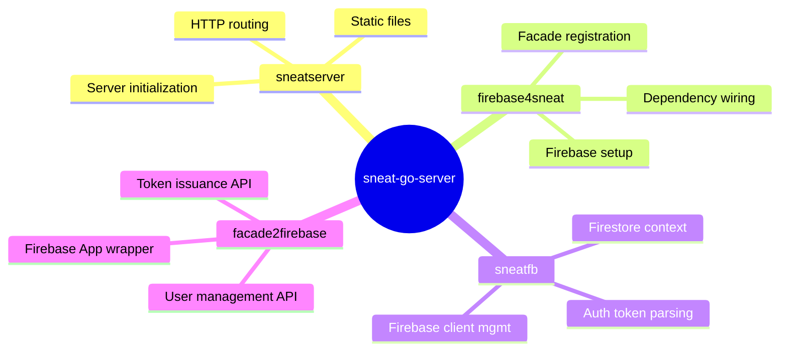
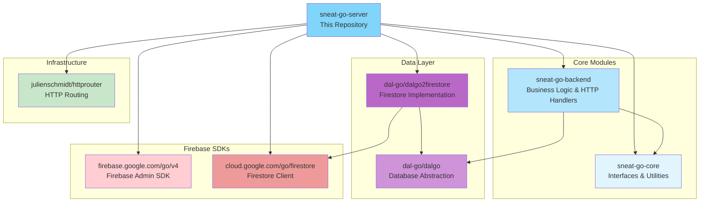
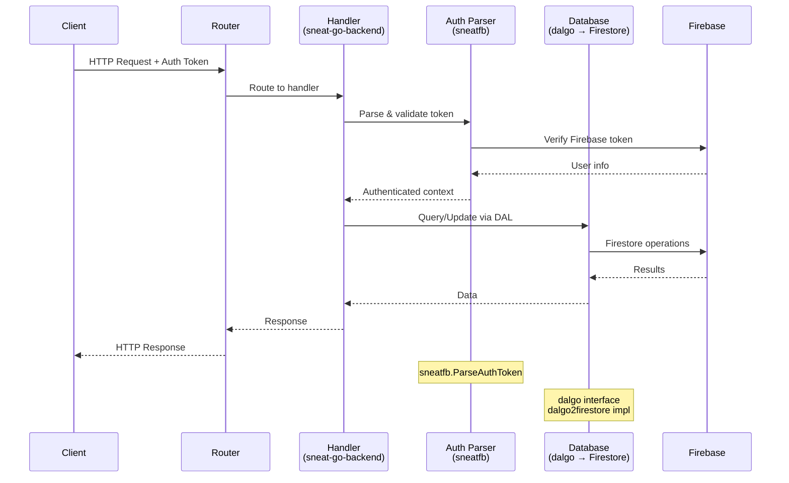
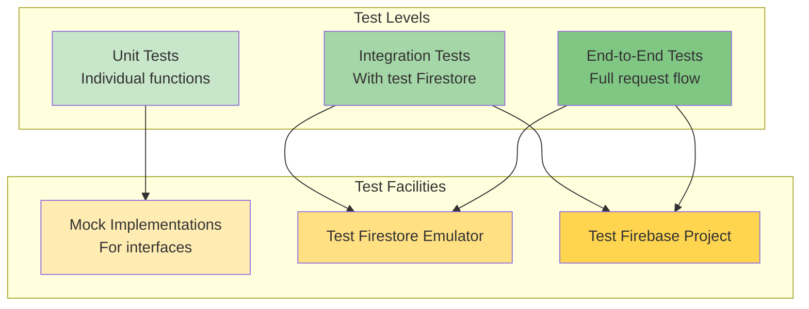

# Sneat Go Server Architecture

This document describes the architecture of the Sneat Go Server, which provides a Firebase-based implementation for the Sneat backend.

## Overview

The `sneat-go-server` is a thin wrapper around the vendor-agnostic `sneat-go-backend` module. It provides Firebase-specific implementations for authentication, database access, and other infrastructure concerns while keeping the core business logic independent of any particular vendor.

## High-Level Architecture

## Package Structure

## Initialization Flow

## Component Interaction

## Key Design Principles

### 1. Dependency Injection

The server uses dependency injection to provide Firebase-specific implementations to the vendor-agnostic backend:

### 2. Abstraction Layers

Multiple abstraction layers keep the codebase maintainable and testable:

### 3. Separation of Concerns

Each package has a clear, single responsibility:

## Module Dependencies

## Request Flow

## Testing Strategy

The architecture enables multiple testing strategies:

## Summary

The Sneat Go Server architecture achieves several key goals:

1. **Vendor Independence**: Core business logic in `sneat-go-backend` remains vendor-agnostic
2. **Clean Abstractions**: DAL pattern allows swapping database implementations
3. **Testability**: Interface-based design enables mocking and testing at multiple levels
4. **Maintainability**: Clear separation of concerns makes code easy to understand and modify
5. **Extensibility**: New implementations can be added by implementing existing interfaces

The architecture follows Go best practices and creates a solid foundation for building a scalable, maintainable backend service.
